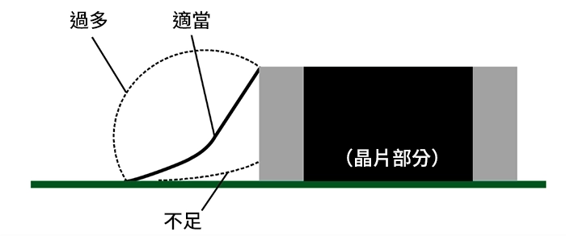

# SMD
- speacher: pro. Huang
- date: 2025-8-12
- class ??

#SMD # ######

## IC 74273
- VCC電源
- RCLK 時鐘派充, 三角形輸入為正源觸發(電壓底轉高)
- GND 接地
- C1 旁路電容, 濾波器
- Q0-Q7 輸出
- D0-D7 輸入

## IC 74244 SMD
- VCC電源
- OE1 (0伏特動作)

## ATMEGA328P-PU
- 處理器
- 接地符號`士`
- 線路交點有圓圈為實體連通

## 220歐姆(SMD 0805)
陶瓷電阻，很小

## LED(RED/Green, SMD 0805)
有正負極之分
長短腳: 長為正, 短接負極
SMD 0805 LED : 綠色為負極

## 焊錫量
- 最寬與下方接點焊錫，應當為45度以下斜角
- 小晶片可以先點一點錫
- 或是錫線跟接腳重疊，用烙鐵快速接觸後離開

參考:techweb.rohm.com.tw/wp-content/uploads/2024/12/7_soldering_tools_021.webp

