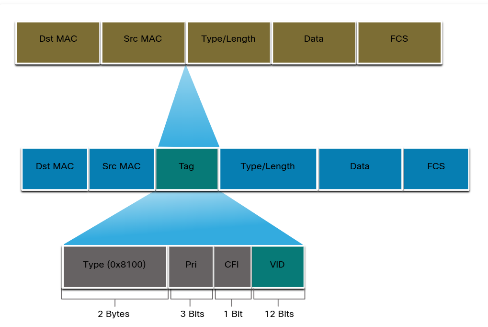

# Vlan
VLAN 透過 Trunk 技術，完美地實現了「**邏輯隔離**」與「**實體線路共用**」這兩個看似矛盾的目標。這也是 VLAN 在現代企業網路中如此重要的原因。 

## define
VLANs are created at Layer 2 to reducing or eliminate **broadcast** traffic.
802.1Q file defined the switch rule
- **Type** - A 2-byte value called the tag protocol ID (TPID) value. For Ethernet, it is set to hexadecimal 0x8100.
- **User priority** - A 3-bit value that supports level or service implementation.
- **Canonical Format Identifier (CFI)** - A 1-bit identifier that enables Token Ring frames to be carried across Ethernet links.
- **VLAN ID (VID)** - A 12-bit VLAN identification number that supports up to 4096 VLAN IDs.



## Switch vlan
預設五個vlan ID
- `vlan 1` default 所有的實體port設為1
- `vlan 1002-1005` Cisco保留的通訊
- `vlan 1006-4094` 延伸範圍，為全球企業註冊使用
- Cisco設備 工作端 Port 只對應一個 vlan 編號
- 對終端port綁定Vlan限制存取無法ping到同網段其他設備
- 不同廠牌trunk協商不穩定，手動設定為佳
- 將預設 VLAN 從 VLAN 1 更改為 VLAN 99，是為了將重要的網路管理流量與使用者流量隔離，並增加攻擊者發動攻擊的難度，從而提升整個網路的安全性。
- **安全性**，當未標記封包經過一台預設vlan99的交換機，封包會自動標記，導致無法正常接收。所以交換機之間會有CDP溝通native trunk.


## switch setting
建立拓樸
- 裝置, 介面、IP、MASK、交換埠、VLAN
- vlan id, name, ports, access
- other Vlan id ,name , ports ,trunk
- Native vlan, VOICE vlan, ip default-gateway


## 實務
1. login password (console 0, vty 0 15)
2. base configuration (hostname, banner, ip gateway, encrypt pwd)
3. vlan name
- IP (interface vlan 1 Native)
- port bind vlan access, voice
- port bind vlan trunk native vlan, allow vlan
4. trunk (nonegotiate 減少思科設備DTP協定流量)

### 常用輔助指令
```console
# show ip interface
# show vlan brief
# show interface trunk
# show interface status
(config)# interface range g0/1-2,f0/3
```

### sample
```console
SWC(config)# interface f0/4
SWC(config-if)# switchport voice vlan 40
SWC(config-if)# mls qos trust cos
SWC(config-if)# switchport mode access 
SWC(config-if)# switchport access vlan 10

SWA(config)# interface g0/1
SWA(config-if)# switchport mode trunk 
SWA(config-if)# switchport nonegotiate 
SWA(config-if)# switchport trunk native vlan 100
```

## switch Access and Trunk
交換機的 VLAN 連接模式概要
-	**Access Mode**：
	-	每個 Access Port 只能屬於一個 VLAN。
	-	進入的無標籤封包會被打上該 VLAN 的標籤 (VID)。
	-	傳出的封包會移除 VLAN 標籤，送給終端裝置。

-	**Trunk Mode**：
	-	可同時傳輸多個 VLAN 的封包。
	-	已有 VLAN 標籤的封包會檢查 VID 再轉發。
	-	無標籤封包會被套用 Native VLAN 標籤。

## Native 

會出現兩條 Trunk 但 Native VLAN ID 不同的需求，通常是這幾種情境：
1.	**跨網段的管理或隔離需求**
    -	有些網管會把不同交換機之間的管理介面放在不同 VLAN，例如一組設備的管理用 VLAN 10，另一組用 VLAN 20。
    -	雖然兩條 Trunk 都承載多個 VLAN，但因為管理端口的 Native VLAN 不一樣，便於設備在沒有 VLAN 標籤的情況下，也能正確進入對應的管理網段。
2.	**降低 Native VLAN 衝突風險**
    -	若 Trunk 連到不同廠商或不同部門的交換機，Native VLAN ID 不一致可以避免「未標籤封包」誤進錯的 VLAN。
    -	這常見於兩個網路區塊交界的連接線，讓未標籤封包不會自動混到同一 VLAN。
3.	**漸進式 VLAN 重構或遷移**
    -	網路在改版時，部分 Trunk 先改成新的 Native VLAN，而舊系統還用舊的 Native VLAN。
    -	這樣可以逐步遷移，不會一次影響全部連線。
4.	**應對不同用途的鏈路**
    -	例如一條 Trunk 專門服務語音 VLAN（Native 設為語音 VLAN），另一條專門服務監控 VLAN。
    -	這樣可以讓某些特定未標籤流量自動進入正確用途的 VLAN，而不用在端口端手動打標籤。

