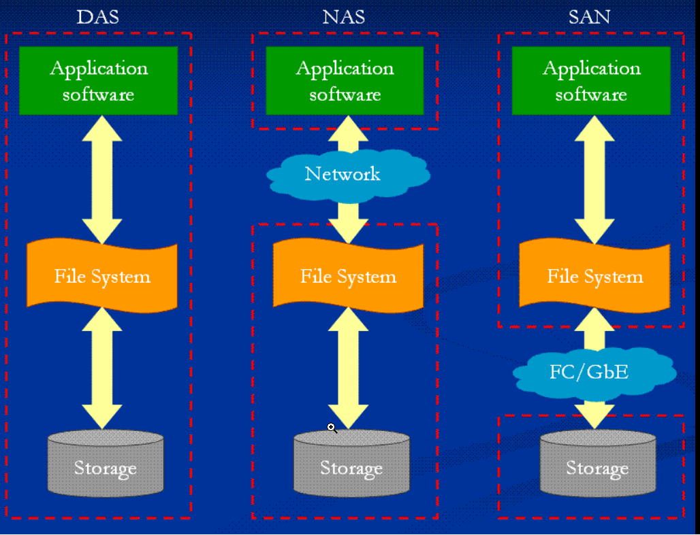

vm win11 install
```
VM setting > network > uncheck NAT when power on
shift+F10 > popout admin command line > oobe\bypassnro
```

尋找更新檔位置
>設定>首頁>應用程式與功能>右邊拉到底 相關設定 程式和功能> 左列 檢視已經安裝好的更新> 依序移除更新檔 (KB46............. framework)

## 比較更新後的虛擬機
win10_1909_o1909, **55.9** GB
win10_22H2_o21h2, **28.2** GB
win11_24H2, **25.8** GB


compare DAS、NAS、SAN

TKM 知識交流平台

VM 用 hypervision管理VM
管理多台實體機器轉移虛擬機 
SAN(Storage Area Network)實體架構能夠充分實現虛擬機運載平衡技術

