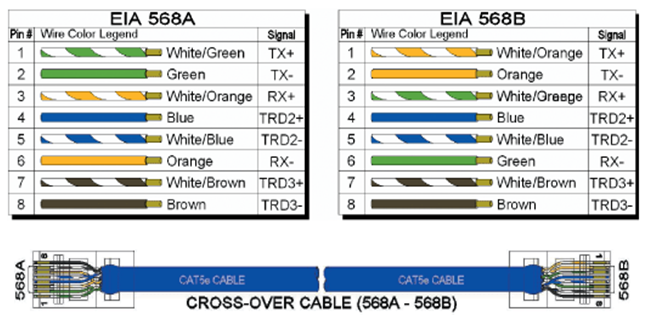

# 網路
- speacher: pro. Cheng
- date: 2025-7-22
- class 4
- cable and hub

- 同軸電纜
- ring token
- hub
- modem
- 

## RJ45
1. google tia 568A

白綠綠白橙藍白藍橙白棕棕

2. tie568B
白橙橙白綠藍白藍綠白棕棕

3. 直線
AA or BB 電腦接交換機

4. 跳線
AB or BA 交換機連線交換機

5. 製作
* 理線要直，手指抓八條前後凹順，剪齊
* 非穿透式留1、2cm
* 穿透式應當配置理線夾
* 外被PVC要穿進凹溝才能壓接
