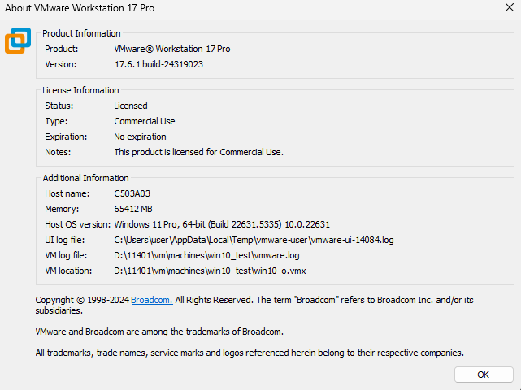

pro. 曾
- 虛擬化
- 

登入google 群組分頁
it網管人 
tag

windos server 2025 16core 3~5w each
tag[upgrade]

textbook windows server 2022 build up
keywords and tag

google: server 2025 download 
get the iso

# 暫停(suspended)的機器 能不能移動?  
與虛擬機本體VMware workstation 版本組態有關係 host os version
或是硬體不一樣 導致資源不足
+ host os version
+ ram大小 
+ CPU新舊版本支援

.vmdk 起始12G會越來越大
.vmem 隨時啟動4G

不要安裝兩個掃毒軟體

伺服器風扇啟動必轉 檢測設備軟硬體

# 常用埠標準
C:\Windows\System32\drivers\etc\services

確認 > win+R > cmd > netstat -a | more

search
taskmgr 工作管理員
intermgr 

目標
三台機器
win10_1909 => 22h2
win10_21H2 => 22h2
win11_23h2

容量更新後超級膨脹
可能膨脹三倍

複製虛擬機(要關機)
來使用

 
檢查更新後不要動它確保底下更新能夠照順序完成

再安裝一台win10_21H2

第一次進入要觸發DVD啟動 (time-out 時Ctral+Alt+Insert重啟後再按空白鍵)

每一台新安裝都要掛vmtools 且進入虛擬機內安裝

更新ram 用4GB

win10> 設定 > 系統> 關於> Windows版本 

iso檔為安裝 或 備援 時使用 工作結束後可以分享給其他虛擬機

還沒安裝完無法反安裝

win10 : restart and upgrade

bash cmd file format is filename.sh on windows 

location: setting> option> working directory

### 確認路徑與虛擬機OS版本
1. 確認路徑
在VMware 打開設定 option > general > working directory > path
2. 確認原始iso
vm設定 Hardware > CD/DVD(SATA)> Use ISO image file:

# 更新錯誤 
> 無法在 2025/6/10 - 0x8024000b 上安裝
解除安裝 2021 年 5 月 11 日-`KB4601556` `.NET Framework 3.5` 和 `4.8 Windows 10` 版本 `1909` 和 Windows Server 版本 1909 的累積更新
然後重開機後更新

sfc /scannow
DISM /Online /Cleanup-Image /RestoreHealth

用7zip封裝VM (管理者.txt)

### 1909 更新 22H2 必要條件
在使用啟用套件更新至 Windows 10 版本 `22H2` 之前，您必須執行 Windows 10、版本 `2004`、`20H2` 或 `21H1`。 您必須先安裝下列先決條件，才能套用此更新：
Windows 10版本 2004 的維護堆疊更新：2020 年 9 月 8日或更新版本維護堆疊更新
2022 年 7 月 26 日 - `KB5015878` (19041.1865) 或更新版本的累積更新

解決方案仍然是：

使用 Windows 10 媒體建立工具進行「就地升級 (In-place Upgrade)」：
下載最新版本的 `Windows 10 媒體建立工具`。
執行工具，選擇`「立即升級此電腦」`。
這個過程會下載完整的 `22H2` 安裝檔案，然後將您的 `1909` 版本直接升級到 `22H2`，同時保留您的個人檔案和應用程式。

磁區必須是`簡單磁區`，不能是`動態磁區`

要將未配置的 20GB 空間合併到 C 槽，而中間夾著一個 614MB 的修復磁碟分割，Windows 內建的磁碟管理工具是無法直接完成的，因為它只能將未配置空間合併到其左側緊鄰的分區。

你主要有兩種方法來解決這個問題：

**方法一：使用第三方磁碟分區工具 (推薦)**

這是最簡單也最安全的方法。許多第三方磁碟分區管理軟體都支援移動分區，這樣你就可以把修復磁碟分割移動到未配置空間的右邊，然後再將 C 槽擴展。

以下是一些常見且廣受好評的免費或付費磁碟分區工具：

* **MiniTool Partition Wizard Free Edition**
* **AOMEI Partition Assistant Standard Edition**
* **EaseUS Partition Master Free**

**操作步驟大致如下（以 MiniTool Partition Wizard 為例）：**

1.  **下載並安裝**你選擇的第三方磁碟分區工具。
2.  **啟動**該軟體。你會看到你的硬碟分區圖。
3.  **找到並右鍵點擊**那個 614MB 的「修復磁碟分割」。
4.  選擇「**Move/Resize Partition**」（移動/調整分區）選項。
5.  在彈出的視窗中，**將修復磁碟分割拖曳到最右邊**（即未配置空間的右側），這樣未配置空間就會緊鄰 C 槽。
6.  **點擊「OK」**確認移動。
7.  接著，**找到並右鍵點擊**你的 C 槽。
8.  再次選擇「**Move/Resize Partition**」。
9.  **將 C 槽的邊緣向右拖曳**，以佔用剛剛移動後的未配置空間。
10. **點擊「OK」**確認調整。
11. 最後，在軟體的主介面中，**點擊「Apply」**（應用）按鈕來執行所有變更。軟體可能會要求重新啟動電腦才能完成操作。

**重要注意事項：**

* **務必備份重要資料！** 儘管這些工具通常很穩定，但任何對硬碟分區的操作都有潛在風險。
* 操作前，請確保你的電腦電量充足 (如果是筆記型電腦) 或連接了穩定的電源。
* 關閉所有不必要的應用程式，避免干擾磁碟操作。

**方法二：使用 DiskPart 命令 (複雜且風險較高)**

這個方法需要你先刪除修復磁碟分割，然後擴展 C 槽，最後再重新建立修復磁碟分割。**這個方法比較複雜且有風險，除非你非常熟悉 DiskPart 命令，否則不建議使用，因為一個錯誤的命令可能導致資料丟失或系統無法啟動。**

如果你決定使用 DiskPart，大致步驟如下：

1.  **禁用 Windows 恢復環境 (WinRE)**：
    * 以管理員身份打開命令提示字元 (CMD)。
    * 輸入 `reagentc /disable` 並按 Enter。
2.  **啟動 DiskPart**：
    * 在命令提示字元中輸入 `diskpart` 並按 Enter。
3.  **識別並刪除修復磁碟分割**：
    * 輸入 `list disk` 並按 Enter，找出你的硬碟編號 (通常是 Disk 0)。
    * 輸入 `select disk X` (X 是你的硬碟編號，例如 `select disk 0`)。
    * 輸入 `list partition` 並按 Enter，找出你的修復磁碟分割的編號 (通常是 614MB 左右)。
    * 輸入 `select partition Y` (Y 是修復磁碟分割的編號)。
    * **小心！** 輸入 `delete partition override` 並按 Enter。這將刪除該分區。
4.  **擴展 C 槽**：
    * 再次輸入 `list partition`，找出你的 C 槽的編號。
    * 輸入 `select partition Z` (Z 是 C 槽的編號)。
    * 輸入 `extend` 並按 Enter。這會將所有緊鄰的未配置空間合併到 C 槽。
5.  **重新建立修復磁碟分割** (這是最複雜的部分，需要確保正確的 GUID 和屬性)：
    * 這通常涉及到在 C 槽末尾再次縮小一部分空間來創建一個新的修復分區，並賦予它正確的 ID 和屬性。具體步驟因系統類型 (GPT 或 MBR) 而異，且命令複雜。

**總結：**

強烈建議你使用**第三方磁碟分區工具**來解決這個問題。它們提供圖形化介面，操作更直觀，且大大降低了操作失誤導致的風險。記得在操作前進行資料備份。
