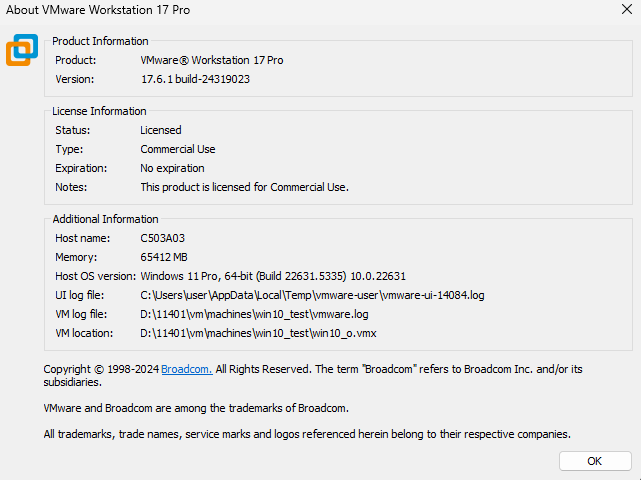

pro. 曾
- 虛擬化
- 

登入google 群組分頁
it網管人 
tag

windos server 2025 16core 3~5w each
tag[upgrade]

textbook windows server 2022 build up
keywords and tag

google: server 2025 download 
get the iso

# 暫停(suspended)的機器 能不能移動?  
與虛擬機本體VMware workstation 版本組態有關係 host os version
或是硬體不一樣 導致資源不足
+ host os version
+ ram大小 
+ CPU新舊版本支援

.vmdk 起始12G會越來越大
.vmem 隨時啟動4G

不要安裝兩個掃毒軟體

伺服器風扇啟動必轉 檢測設備軟硬體

# 常用埠標準
C:\Windows\System32\drivers\etc\services

確認 > win+R > cmd > netstat -a | more

search
taskmgr 工作管理員
intermgr 

目標
三台機器
win10_1909 => 22h2
win10_21H2 => 22h2
win11_23h2

容量更新後超級膨脹
可能膨脹三倍

複製虛擬機(要關機)
來使用

 
檢查更新後不要動它確保底下更新能夠照順序完成

再安裝一台
win10_21H2
第一次進入要觸發DVD啟動 (time-out 時Ctral+Alt+Insert重啟後再按空白鍵)
每一台新安裝都要掛vmtools

更新ram 用4GB

win10> 設定 > 系統> 關於> Windows版本 
iso檔為安裝 或 備援 時使用 工作結束後可以分享給其他虛擬機

還沒安裝完無法反安裝

bash cmd file format is filename.sh on windows 
